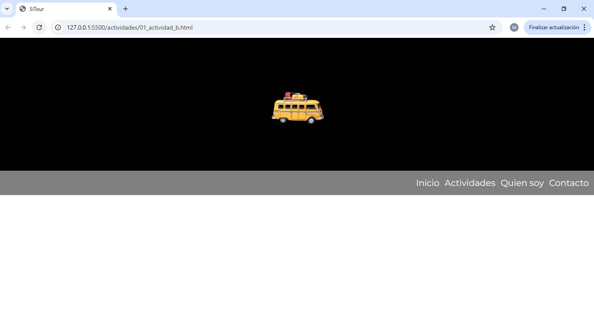

# Actividad 1

## Apartado a)

Crea un nuevo html llamado "actividad1_a.html" con la misma estructura del ejemplo de clase. Selecciona sólo la información relativa al cabecero de la página. Modifica el código css (style_act1_a.css) para incorporar el elemento **figure** a la hora de trabajar con la imagen. El cabecero ha de ocupar un **20%** de la anchura.

## Apartado b)

Crea un nuevo html llamado "actividad1_b.html" con la misma estructura del ejemplo de clase. Selecciona sólo la información relativa a cabecero de la página. Modifica el código css (style_act1_b.css) para crear una imagen como la indicada en el siguiente ejemplo:

