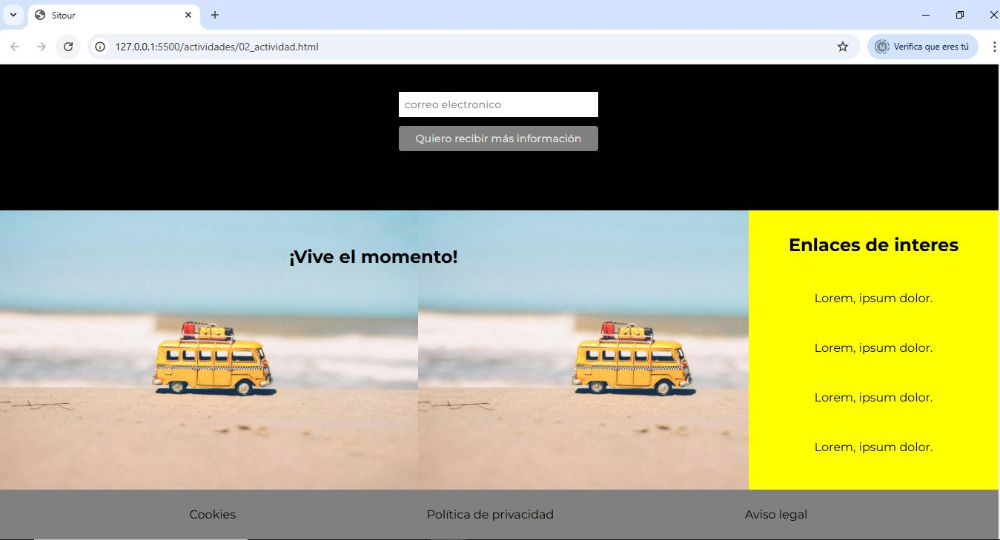
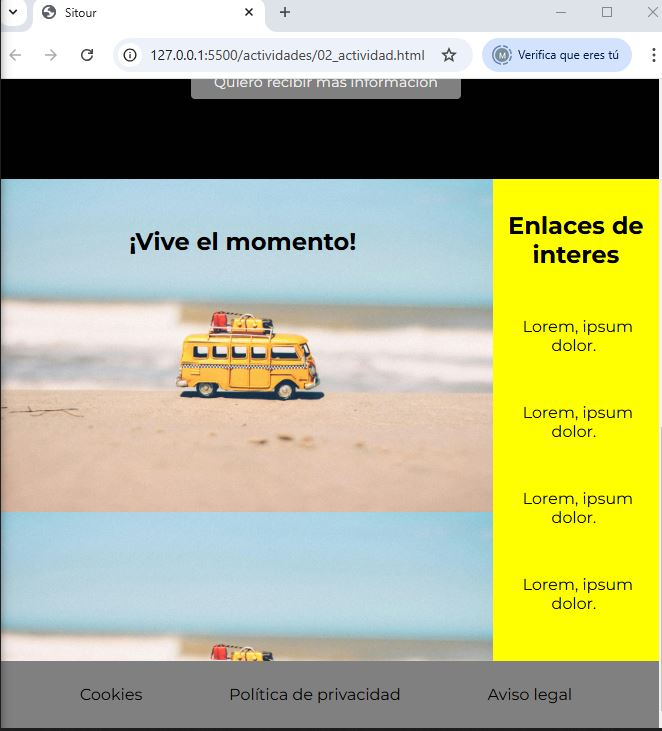

# Actividad 2: 

## Apartado a: Creación del footer

Finaliza la creación del proyecto web incluyendo la parte CSS del footer. 
Este ha de ocupar una anchura de 1.5rem por arriba y por abajo desde la posición de los enlaces.

## Aparto b: Mejora estética y funcional de tu proyecto web

Mejora el diseño y la funcionalidad del proyecto web trabajado hasta el momento, aplicando estilos CSS para incorporar un banner, un elemento lateral (aside) y efectos visuales en los enlaces.

### Descripción de la actividad

* **Banner principal**

Añadir un banner en la parte inferior de la página web (después del formulario de contactos) que incluya:
Una imagen de fondo que cubra todo el banner.
La frase __"¡Vive el momento!"__ centrada en el banner.
Para lograrlo, deberás investigar y aplicar las siguientes propiedades CSS:
    * background-image
    * background-size
    * background-repeat

* **Elemento lateral (aside)**

Añadir un elemento aside con el título __"Enlaces de interés"__.
Dentro del aside, incluir al menos 3 enlaces con contenido de ejemplo.
Cada enlace debe estar separado del anterior por una distancia de 3rem utilizando CSS.

* **Efecto en los enlaces**

Al pasar el ratón (hover) sobre los enlaces, estos deberán ponerse en negrita.
Asegúrate de utilizar selectores adecuados para aplicar este efecto.
Adaptación de la página

## Apartado c: Resolución adaptable

La página web debe verse estéticamente bien cuando la pantalla se reduzca a la mitad de su tamaño (resolución adaptable).
Esto incluye que los elementos no se desborden y que el contenido siga siendo legible y ordenado.

